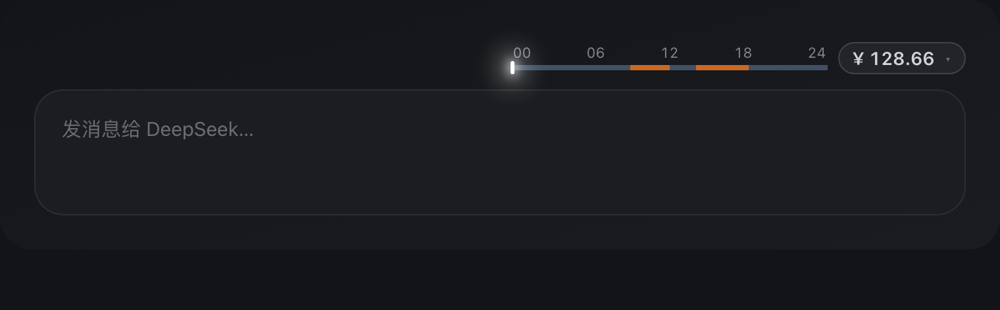

# 峰谷电表 dsh-valley-meter

<div align="center">

**DeepSeek Harness 峰谷电表 · 波谷倒计时与余额读数**

余额数字徽章 · 悬停 24 小时峰谷时间轴 · 官方余额 5 秒刷新 · 今日消耗独立计费 — 10 套沉稳配色预置 + 谷/峰色自定义,全中文界面。

[](https://github.com/uckkk/dsh-valley-meter)
[](LICENSE)
[](https://github.com/deepseek-ai/deepseek-harness)

English | **中文**

</div>


**悬停浮现峰谷时间轴**



## 这是什么

一个**极简**的 DeepSeek Harness 插件,在输入框上方右侧挂一枚低调的**余额数字徽章**;光标悬停时,徽章左侧浮现一条 **24 小时峰谷时间轴**:

| 读数 | 说明 |
|---|---|
| **余额数字徽章** | 默认只显示官方账户余额数值(插件独立查询 `/user/balance`,每 5 秒自动刷新) |
| **峰谷时间轴** | 悬停浮现的 24 小时横向时间轴:峰段(橙) / 谷段(蓝)双色 + 白色发光指针标当前本地时刻,00/06/12/18/24 刻度在上方 |
| **今日消耗** | 当日费用(插件独立监听 `llm/stream` 实时计费,写入账本) |

## 核心特性

- **配色方案**:内置 10 套沉稳配色预置(One Dark / Dracula / Nord / Tokyo Night / Gruvbox / Solarized + 中国传统色 / 潘通),也可用拾色器自定义谷色 / 峰色,改完即时生效。
- **悬停即见**:默认只显示余额数字,光标悬停才浮现峰谷时间轴,不占输入区空间。
- **实时余额**:官方余额每 5 秒自动刷新,无需手动操作。
- **本地时区时间轴**:峰/谷时段按 UTC 窗口自动换算成本地时区显示,白色发光指针标当前时刻。
- **完全独立、实时计费**:插件自己监听 `llm/stream` 捕获用量、按官方价格折算费用,自己查询 DeepSeek 官方余额,自己维护账本(`~/.dsh/storages/valley-meter/ledger.json`),**不依赖任何其它插件**。

## 安装

```bash
# 在 web profile 中安装(把 <包路径> 换成该插件包的本地路径或 npm 包名)
dsh plugin --profile web add <包路径>
```

然后重启 dsh web 页面即可看到余额数字徽章。

## 配置

打开 **设置 → 峰谷电表**:

- **配色方案**:10 套预置(编辑器主题 6 套 + 中国传统色 / 潘通 4 套)或「自定义」。
- **谷时颜色 / 峰时颜色**:拾色器,选「自定义」后即时生效。
- **余额显示标题** / **今日花费显示标题** / **显示倒计时**:分别开关。

配置写入 `~/.dsh/storages/valley-meter/config.json`。

## 数据来源说明

本插件**独立计费与查询**,不依赖任何其它插件:

- **今日费用**:监听 `llm/stream` 捕获每次调用的 usage,按内置模型价格表(含峰/谷两档)+ 峰谷时段折算,写入自己的账本 `~/.dsh/storages/valley-meter/ledger.json`。
- **账户余额**:用 DSH 凭据库/`DEEPSEEK_API_KEY` 查询 DeepSeek 官方 `/user/balance`,每 5 秒自动刷新。
- **峰谷窗口**:插件自身配置(默认 UTC 01–04、06–10),可在设置里调整。

未配置 API Key 时,余额显示「暂无数据」,今日费用仍正常累计,不会报错。

## 开发

```bash
pnpm install
pnpm run build   # 构建 lib/client.js bundle
pnpm run check   # typecheck + test + build
```

## License

MIT
